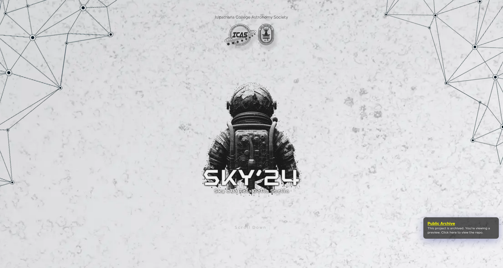
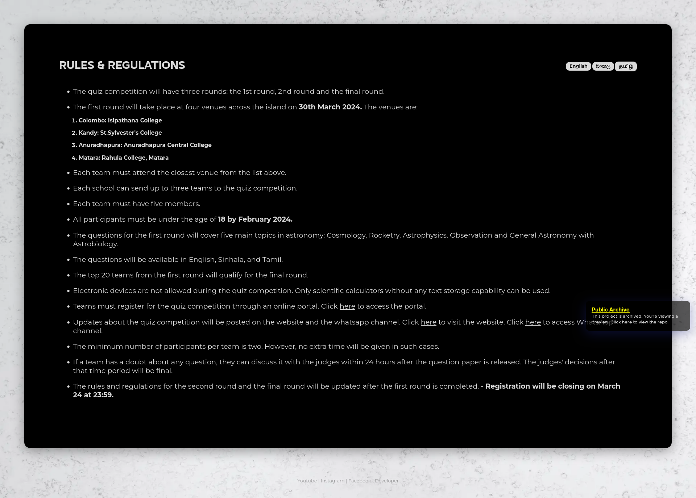
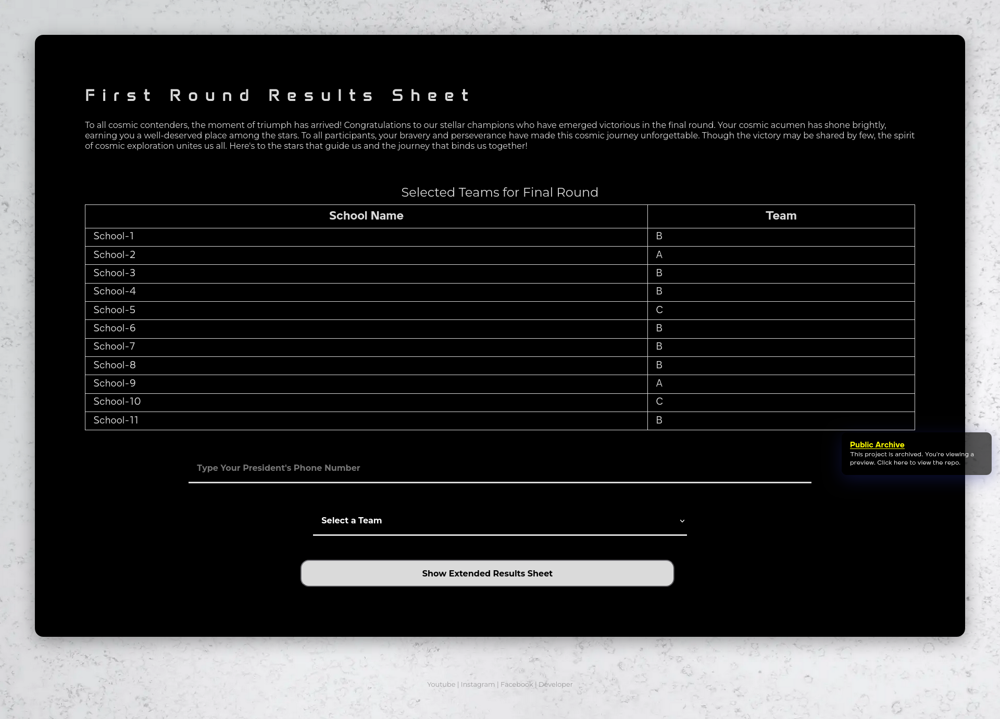
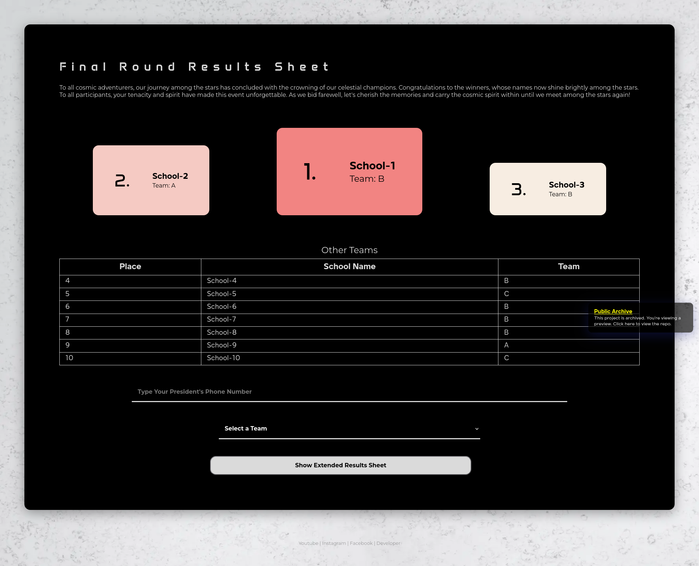
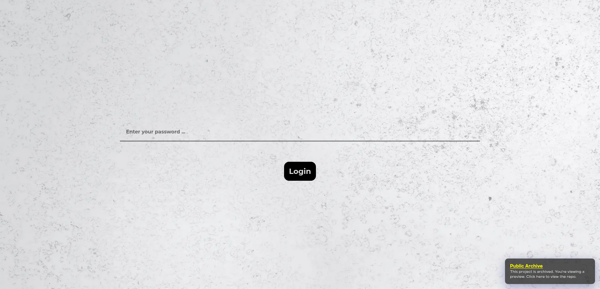
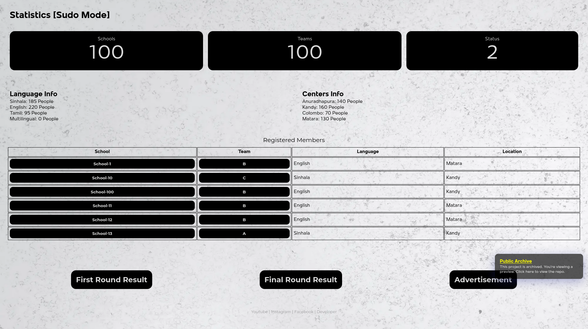
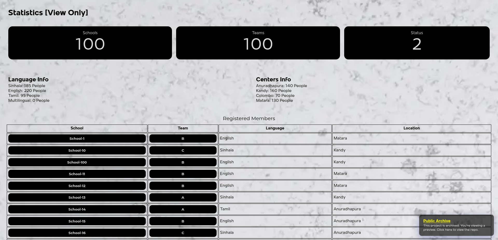
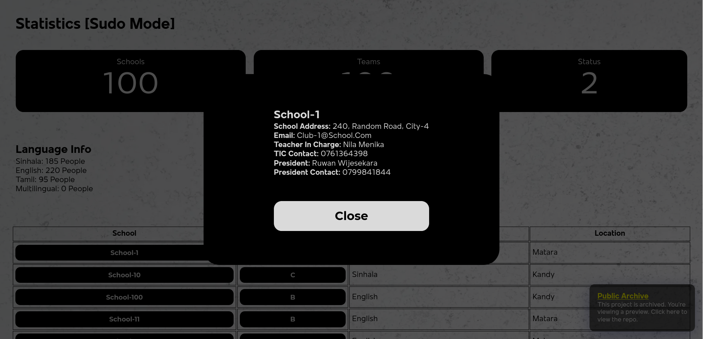

```
 ________  ___  __        ___    ___  _______  ___   ___     
|\   ____\|\  \|\  \     |\  \  /  /|/  ___  \|\  \ |\  \    
\ \  \___|\ \  \/  /|_   \ \  \/  / /__/|_/  /\ \  \\_\  \   
 \ \_____  \ \   ___  \   \ \    / /|__|//  / /\ \______  \  
  \|____|\  \ \  \\ \  \   \/  /  /     /  /_/__\|_____|\  \ 
    ____\_\  \ \__\\ \__\__/  / /      |\________\     \ \__\
   |\_________\|__| \|__|\___/ /        \|_______|      \|__|
   \|_________|         \|___|/                              
   
 This project/repository has been archived by the owner on Dec 12, 2024.                                                         
```

**Sky24** is a web portal developed for the Astronomy Quiz SKY24, organized by the Isipathana College Astronomical Society. It allows users to register, check the event status, and view results. Administrators have access to a dashboard to manage user information, update event details, change site settings, dynamically update the database, and perform various other tasks.

# Technologies Used
[](https://console.firebase.google.com)
[](https://nextjs.org)

# Preview
Since the event has concluded, we deleted the Firebase project, and the site is no longer accessible through the default URL. Instead, you can visit https://mrbhanukab.github.io/sky24/ to view an archived preview of the site. You can explore all actions freely, but note that nothing will function on the backend since it is no longer active. While some features may not work due to the lack of backend access, 99% of the site’s functionality remains intact. Feel free to give it a try!
## Home
This is the homepage, accessible at https://mrbhanukab.github.io/sky24/.

By default, the event info displays 'FINAL ROUND RESULT ...'. It was supposed to fetch the current status from the database and display it dynamically. However, you can try changing the event and explore all options by pressing the event indicator.


## Registration Forms
This is what the registration page looked like. You can try filling out the form and submitting it. You can access it at https://mrbhanukab.github.io/sky24/register/.


## Rules & Regulations Page
This is how the Rules and Regulations page looks. It fetches an MD file and displays it. It supports multiple languages: Sinhala, Tamil, and English. You can access it at https://mrbhanukab.github.io/sky24/rules/.


## First Round Results Sheet
This is how the First Round Results sheet looks. You can try the team `'B'` with the number `0799841844`. It is accessible at https://mrbhanukab.github.io/sky24/round/firstRound/


## Second Round Results Sheet
This is how the Second Round Results sheet looks. You can try the team `'B'` with the number `0799841844`. It is accessible at https://mrbhanukab.github.io/sky24/round/finalRound/


# Admin Dashboard
This is how the admin dashboard looks. It allows admins to edit user info, update event details, change site settings, dynamically update the database, and more. You can access it via https://mrbhanukab.github.io/sky24/wtfadmin/. The passwords are:
- `password-admin`: Used to access the admin portal. 
- `password-viewer`: Used to access the view-only portal.



## Statistics [Sudo Mode]


## Statistics [View Only]


### User Information
You can try clicking each school or team to view the team info.
